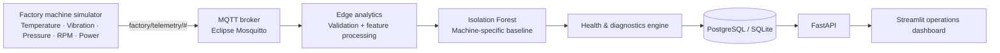

# IndustrialEdge AI

**Production-style industrial AI platform for real-time machine monitoring, anomaly detection and predictive maintenance.**

[](https://www.python.org/)
[](https://fastapi.tiangolo.com/)
[](https://mqtt.org/)
[](https://www.docker.com/)
[](https://scikit-learn.org/)
[](https://github.com/features/actions)

IndustrialEdge AI is a self-contained factory intelligence demo built to show how an ML model becomes part of an operational **OT/IT data pipeline**, rather than living in a notebook. Four simulated industrial machines publish telemetry over MQTT. The edge analytics service validates the stream, scores anomalies with machine-specific Isolation Forest models, estimates machine health, stores events, exposes them through FastAPI, and visualizes them in a live dashboard.

`MACHINE-04` intentionally develops a progressive bearing-style fault so the full pipeline can be demonstrated in minutes.

## Why this project

Industrial AI is not only about training a model. Production systems must connect equipment, move telemetry reliably, evaluate models continuously, explain abnormal behavior, persist events and provide operators with actionable information. This repository demonstrates that full path with an architecture that can run on a laptop.

## Architecture



## What the demo shows

- **Real-time telemetry:** five operational signals from four machines over MQTT.
- **Fault simulation:** progressive vibration, temperature, power and RPM drift on Machine 04.
- **ML anomaly detection:** independent Isolation Forest baseline per machine.
- **Explainability:** the largest standardized sensor deviations are surfaced as anomaly drivers.
- **Machine health:** converts model output and engineering stress into a 0–100 health score.
- **Actionable diagnostics:** bearing-style temperature + vibration patterns generate a maintenance recommendation.
- **Persistence:** PostgreSQL in Docker, SQLite for lightweight local development.
- **API-first design:** telemetry can also be POSTed directly to FastAPI for integration testing.
- **Containerized deployment:** broker, database, API, simulator and dashboard start together.
- **CI:** linting and unit tests run on every push and pull request.

## Run the complete system

Requirements: Docker + Docker Compose.

```bash
git clone https://github.com/Lonfea/industrialedge-ai.git
cd industrialedge-ai
docker compose up --build
```

Then open:

- Dashboard: `http://localhost:8501`
- API docs: `http://localhost:8000/docs`
- API health: `http://localhost:8000/health`

The simulator starts with normal data. After roughly 45 telemetry cycles, Machine 04 progressively develops the injected fault. The dashboard should move from green to warning/critical as the anomaly becomes stronger.

## Run the analytics tests without Docker

```bash
python -m venv .venv
source .venv/bin/activate  # Windows: .venv\\Scripts\\activate
pip install -e ".[dev]"
pytest -q
```

## API examples

Latest machine states:

```bash
curl http://localhost:8000/machines
```

Machine history:

```bash
curl "http://localhost:8000/machines/MACHINE-04/history?limit=60"
```

Direct telemetry ingestion:

```bash
curl -X POST http://localhost:8000/telemetry \\
  -H "Content-Type: application/json" \\
  -d '{
    "machine_id":"MACHINE-04",
    "temperature":92.5,
    "vibration":7.8,
    "pressure":5.8,
    "rpm":3210,
    "power":5.1
  }'
```

## Repository structure

```text
industrialedge-ai/
├── config/                 machine engineering baselines
├── dashboard/              live Streamlit operations UI
├── mosquitto/              local MQTT broker config
├── src/industrialedge_ai/
│   ├── analytics/          anomaly model + health/diagnostics
│   ├── api/                FastAPI service
│   ├── ingestion/          MQTT consumer
│   ├── simulator/          industrial telemetry + fault injection
│   └── storage/            SQL persistence
├── tests/                  analytics tests
├── .github/workflows/      CI pipeline
├── Dockerfile
├── docker-compose.yml
└── pyproject.toml
```

## Engineering decisions

### Why MQTT?
MQTT is lightweight and common in IoT/edge architectures. It keeps the simulator and analytics service decoupled and makes it straightforward to swap simulated publishers for real gateways later.

### Why machine-specific baselines?
A compressor and a motor do not share the same normal temperature, vibration or operating speed. Each detector therefore learns from the nominal engineering envelope of its own machine.

### Why synthetic healthy data?
The project is intentionally reproducible and does not pretend that generated telemetry is a real predictive-maintenance dataset. Synthetic baselines make the software architecture testable without proprietary factory data. In a production deployment, this boundary would be replaced with historian/SCADA/PLC telemetry and a validated training dataset.

### Why edge-first?
Anomaly inference is close to the telemetry source, while persistence and the dashboard remain independently replaceable. That maps naturally to industrial environments where latency, resilience and data-governance constraints can make local processing valuable.

## Roadmap

- [x] MQTT streaming pipeline
- [x] Multi-machine simulator
- [x] Progressive fault injection
- [x] Isolation Forest anomaly detection
- [x] Machine health scoring
- [x] Explainable top-signal diagnostics
- [x] PostgreSQL / SQLite persistence
- [x] FastAPI service
- [x] Live dashboard
- [x] Docker Compose deployment
- [x] GitHub Actions CI
- [ ] MLflow experiment/model tracking
- [ ] OPC UA gateway adapter
- [ ] LLM maintenance copilot with telemetry-grounded tool calls
- [ ] Alert routing and incident workflow
- [ ] Model drift monitoring
- [ ] Role-based access and audit logging
- [ ] Kubernetes / Industrial Edge deployment example

## Portfolio talking points

This project is designed around questions that commonly matter in industrial AI interviews:

1. How do you move data from OT equipment into an IT/AI system?
2. How do you distinguish machine-specific normal behavior from anomalies?
3. How do you turn an anomaly score into something useful to an operator?
4. How do you deploy and test the entire pipeline reproducibly?
5. How would you replace the simulator with a PLC, OPC UA server or production historian?
6. How would you monitor model drift and false positives after deployment?

## Disclaimer

This is an engineering portfolio project using synthetic telemetry. Its health scores and maintenance recommendations are illustrative and must not be used as safety-critical maintenance decisions without domain validation and appropriate industrial safety controls.

## License

MIT
