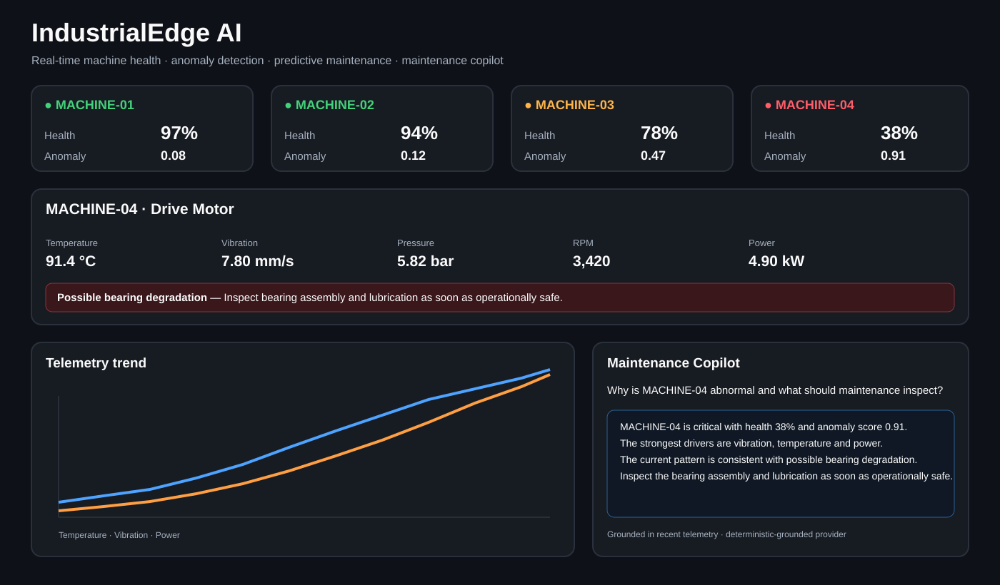
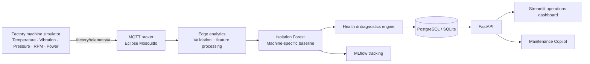

# IndustrialEdge AI

**Production-style industrial AI platform for real-time machine monitoring, anomaly detection, predictive maintenance, MLOps and telemetry-grounded maintenance assistance.**

[](https://www.python.org/)
[](https://fastapi.tiangolo.com/)
[](https://mqtt.org/)
[](https://www.docker.com/)
[](https://scikit-learn.org/)
[](https://mlflow.org/)
[](https://github.com/Lonfea/industrialedge-ai/actions/workflows/ci.yml)

IndustrialEdge AI is a self-contained factory intelligence demo built to show how an ML model becomes part of an operational **OT/IT data pipeline**, rather than living in a notebook. Four simulated industrial machines publish telemetry over MQTT. The edge analytics service validates the stream, scores anomalies with machine-specific Isolation Forest models, estimates machine health, stores events, exposes them through FastAPI, tracks model baselines in MLflow, and provides an operator-facing maintenance copilot.

`MACHINE-04` intentionally develops a progressive bearing-style fault so the full pipeline can be demonstrated in minutes.

## Dashboard preview



*Portfolio preview of the fault state represented by the live Streamlit dashboard. The running system uses simulated telemetry from the MQTT pipeline.*

## v0.2 highlights

- **MLflow tracking:** machine-specific Isolation Forest baselines are registered with parameters, thresholds and model artifacts.
- **Maintenance Copilot:** questions are answered from current telemetry, anomaly drivers, health score and recent trends.
- **Provider-ready design:** the copilot works without an external model and can optionally call a compatible chat-completions endpoint.
- **Grounding first:** the assistant is designed not to invent measurements and makes safety-critical limitations explicit.

## Why this project

Industrial AI is not only about training a model. Production systems must connect equipment, move telemetry reliably, evaluate models continuously, explain abnormal behavior, persist events and provide operators with actionable information. This repository demonstrates that full path with an architecture that can run on a laptop.

## Architecture



## What the demo shows

- **Real-time telemetry:** five operational signals from four machines over MQTT.
- **Fault simulation:** progressive vibration, temperature, power and RPM drift on Machine 04.
- **ML anomaly detection:** independent Isolation Forest baseline per machine, benchmarked on real pump data (SKAB).
- **Alarm confirmation:** alarms need 3 anomalous readings out of 5, so single spikes do not page anyone.
- **Explainability:** the largest standardized sensor deviations are surfaced as anomaly drivers.
- **Machine health:** converts model output and engineering stress into a 0–100 health score.
- **Actionable diagnostics:** bearing-style temperature + vibration patterns generate a maintenance recommendation.
- **Persistence:** PostgreSQL in Docker, SQLite for lightweight local development.
- **API-first design:** telemetry can also be POSTed directly to FastAPI for integration testing.
- **MLOps:** MLflow records baseline model parameters, thresholds and model artifacts.
- **Maintenance Copilot:** machine questions are answered from telemetry and model outputs with a deterministic grounded fallback.
- **Containerized deployment:** broker, database, MLflow, API, simulator and dashboard start together.
- **CI:** linting and unit tests run on code changes.

## Run the complete system

Requirements: Docker + Docker Compose.

```bash
git clone https://github.com/Lonfea/industrialedge-ai.git
cd industrialedge-ai
docker compose up --build
```

Then open:

- Dashboard: `http://localhost:8501`
- API docs: `http://localhost:8000/docs`
- MLflow: `http://localhost:5000`
- API health: `http://localhost:8000/health`

The simulator starts with normal data. After roughly 45 telemetry cycles, Machine 04 progressively develops the injected fault. The dashboard should move from green to warning/critical as the anomaly becomes stronger.

## Maintenance Copilot

The default copilot requires no API key. It generates a grounded explanation from machine telemetry and model outputs. An optional compatible external chat model can be configured with `COPILOT_API_URL`, `COPILOT_API_KEY`, and `COPILOT_MODEL`; otherwise the deterministic grounded provider is used automatically.

Example:

```bash
curl -X POST http://localhost:8000/copilot \\
  -H "Content-Type: application/json" \\
  -d '{"machine_id":"MACHINE-04","question":"Why is this machine abnormal and what should maintenance inspect?"}'
```

## Run the analytics tests without Docker

```bash
python -m venv .venv
source .venv/bin/activate  # Windows: .venv\\Scripts\\activate
pip install -e ".[dev]"
pytest -q
```

## API examples

Latest machine states:

```bash
curl http://localhost:8000/machines
```

Machine history:

```bash
curl "http://localhost:8000/machines/MACHINE-04/history?limit=60"
```

Direct telemetry ingestion:

```bash
curl -X POST http://localhost:8000/telemetry \\
  -H "Content-Type: application/json" \\
  -d '{
    "machine_id":"MACHINE-04",
    "temperature":92.5,
    "vibration":7.8,
    "pressure":5.8,
    "rpm":3210,
    "power":5.1
  }'
```

## Repository structure

```text
industrialedge-ai/
├── config/                 machine engineering baselines
├── dashboard/              live Streamlit operations UI + copilot
├── docs/                   portfolio visual assets
├── mosquitto/              local MQTT broker config
├── src/industrialedge_ai/
│   ├── analytics/          anomaly model + health/diagnostics
│   ├── api/                FastAPI service
│   ├── copilot/            grounded maintenance assistant
│   ├── ingestion/          MQTT consumer
│   ├── mlops/              MLflow experiment tracking
│   ├── simulator/          industrial telemetry + fault injection
│   └── storage/            SQL persistence
├── tests/                  analytics tests
├── .github/workflows/      CI pipeline
├── Dockerfile
├── docker-compose.yml
└── pyproject.toml
```

## Measured on real pump data

The detector trains on synthetic data in the demo. To check how it behaves on real sensors, `scripts/benchmark_skab.py` runs it on [SKAB](https://github.com/waico/SKAB), the Skoltech Anomaly Benchmark: a water-pump testbed with vibration, motor current, pressure, temperature and flow sensors, and 34 labelled experiments (valve closures, leaks, rotor imbalance).

The script follows SKAB's published outlier-detection protocol (fit on the first 400 rows of each experiment, score the rest, pool the counts). It first reproduces the leaderboard's own Isolation Forest entry exactly (F1 0.29, FAR 2.56%, MAR 82.89%), which confirms the protocol matches before anything is compared.

| Detector | F1 | False-alarm rate | Missed-alarm rate |
|---|---:|---:|---:|
| SKAB leaderboard Isolation Forest (reproduction) | 0.29 | 2.6% | 82.9% |
| IndustrialEdge detector | 0.67 | 27.7% | 38.2% |
| IndustrialEdge detector + 3-of-5 alarm confirmation | 0.69 | 21.3% | 38.0% |
| 3-sigma on any signal | 0.76 | 44.1% | 15.4% |
| Hotelling T-squared (99th percentile limit) | 0.76 | 50.2% | 12.4% |

What the numbers show:

- **Calibration matters more than the model.** The leaderboard entry and this project both use Isolation Forest. The leaderboard version flags a fixed 0.05% of points and misses 83% of anomalies. This project calibrates the alarm threshold on the healthy data's own score distribution, which raises F1 from 0.29 to 0.67.
- **Alarm confirmation cuts false alarms.** Requiring 3 of the last 5 readings to be anomalous lowers the false-alarm rate from 27.7% to 21.3% without missing more anomalies. The service now uses this for its `alarm` field and warning log. The 3-of-5 setting was evaluated on this same benchmark, so the improvement is indicative.
- **Simple statistics score a higher F1, at a cost.** 3-sigma limits and Hotelling T² reach F1 0.76 but raise a false alarm on 44–50% of normal readings. In a plant, that alarm load would train operators to ignore the system. Choosing between them is a precision/recall trade-off per site, not a clear win either way.
- **The best published methods reach F1 0.78** (Conv-AE, MSET on the SKAB leaderboard). They model time windows, where this detector scores each reading independently.

```bash
python scripts/benchmark_skab.py --output evaluation/skab_benchmark.json
```

The SKAB data is GPL-3.0 licensed, so it is downloaded at run time and not committed.

## Engineering decisions

### Why MQTT?
MQTT is lightweight and common in IoT/edge architectures. It keeps the simulator and analytics service decoupled and makes it straightforward to swap simulated publishers for real gateways later.

### Why machine-specific baselines?
A compressor and a motor do not share the same normal temperature, vibration or operating speed. Each detector therefore learns from the nominal engineering envelope of its own machine.

### Why synthetic healthy data?
The project is intentionally reproducible and does not pretend that generated telemetry is a real predictive-maintenance dataset. Synthetic baselines make the software architecture testable without proprietary factory data. `MachineAnomalyDetector` also accepts a `baseline` array of real healthy history, which is how the SKAB benchmark runs it; in a plant, that would come from the historian.

### Why confirm alarms over several readings?
A single anomalous reading is often noise. `AlarmDebouncer` raises `alarm` only when 3 of the last 5 readings per machine cross the threshold, while `is_anomaly` still reports each reading on its own. Existing databases gain the new `alarm` column automatically on startup.

### Why edge-first?
Anomaly inference is close to the telemetry source, while persistence and the dashboard remain independently replaceable. That maps naturally to industrial environments where latency, resilience and data-governance constraints can make local processing valuable.

### Why MLflow?
Tracking detector configuration, thresholds and model artifacts creates a foundation for model comparison, validation, promotion and later drift monitoring.

### Why a grounded copilot?
A maintenance assistant should not guess sensor values. The copilot receives machine state from the system itself and is designed to stay within that context. Its recommendations are decision support, not safety-critical maintenance authorization.

## Roadmap

- [x] MQTT streaming pipeline
- [x] Multi-machine simulator
- [x] Progressive fault injection
- [x] Isolation Forest anomaly detection
- [x] Machine health scoring
- [x] Explainable top-signal diagnostics
- [x] PostgreSQL / SQLite persistence
- [x] FastAPI service
- [x] Live dashboard
- [x] Docker Compose deployment
- [x] GitHub Actions CI
- [x] MLflow experiment/model tracking
- [ ] OPC UA gateway adapter
- [x] Telemetry-grounded maintenance copilot
- [x] Benchmark on real sensor data (SKAB)
- [x] Alarm confirmation (3-of-5 debounce)
- [ ] Window-based detection (the SKAB leaders model time windows)
- [ ] Alert routing and incident workflow
- [ ] Model drift monitoring
- [ ] Role-based access and audit logging
- [ ] Kubernetes / Industrial Edge deployment example

## Portfolio talking points

This project is designed around questions that commonly matter in industrial AI interviews:

1. How do you move data from OT equipment into an IT/AI system?
2. How do you distinguish machine-specific normal behavior from anomalies, and how well does it work on real sensor data?
3. How do you turn an anomaly score into something useful to an operator?
4. How are model configurations and artifacts tracked with MLflow?
5. How is the maintenance copilot grounded so it does not invent telemetry?
6. How would you replace the simulator with a PLC, OPC UA server or production historian?

## Disclaimer

This is an engineering portfolio project using synthetic telemetry. Its health scores and maintenance recommendations are illustrative and must not be used as safety-critical maintenance decisions without domain validation and appropriate industrial safety controls.

## License

MIT
